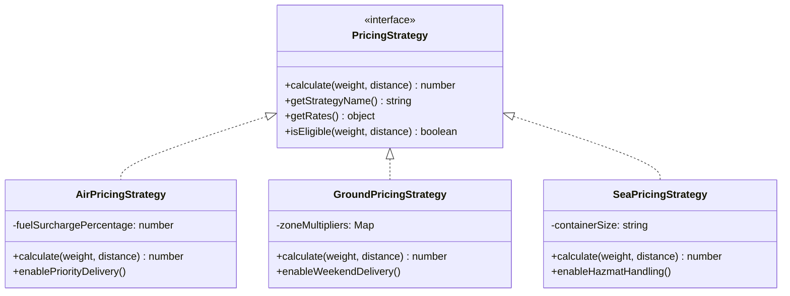
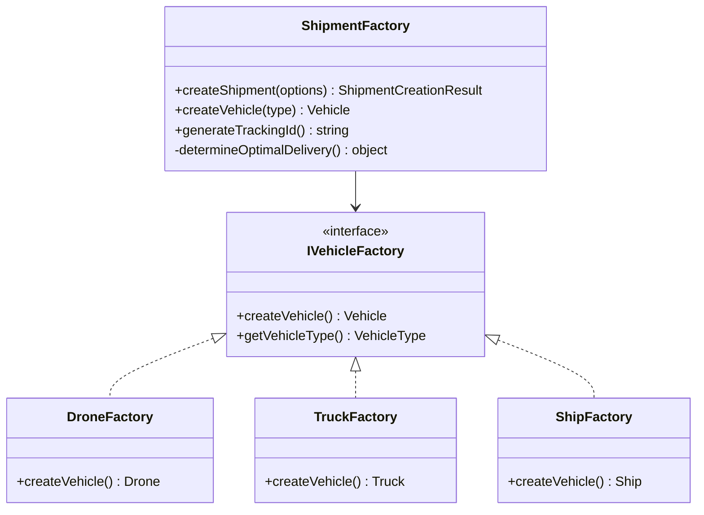
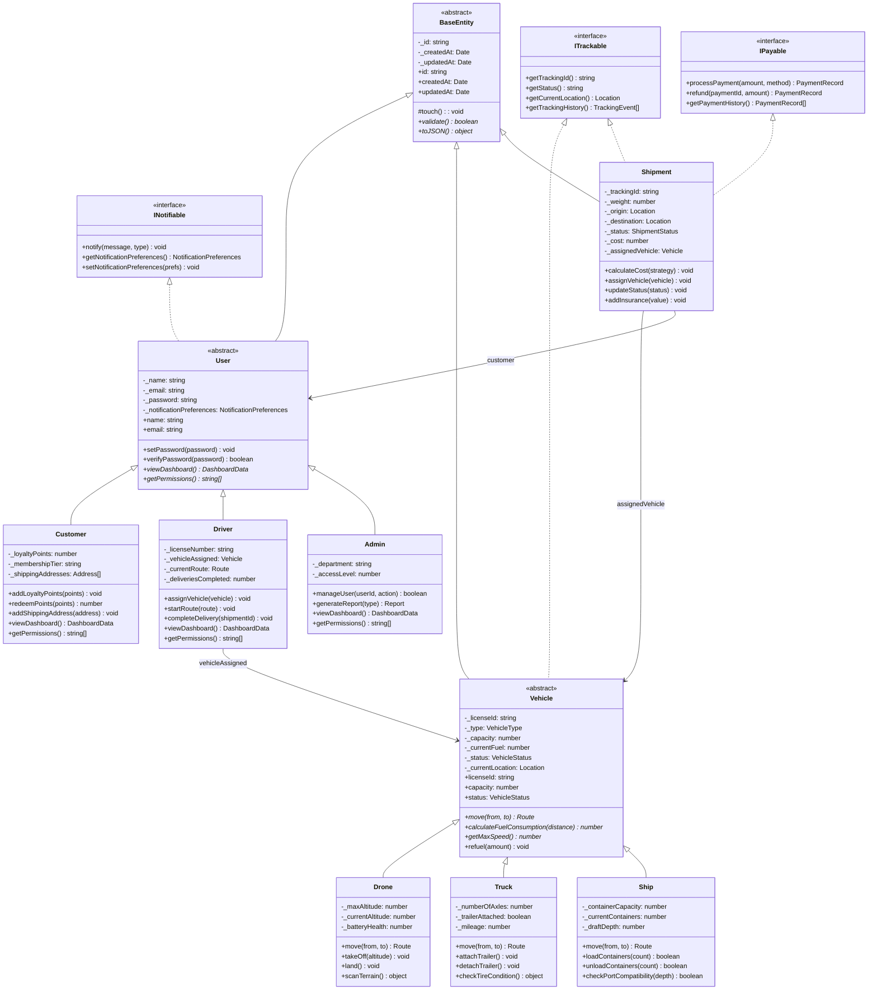

# 🚀 Object-Oriented Programming (OOP) Documentation

## Logistics Management System - Complete OOP Implementation

This document provides a comprehensive overview of all Object-Oriented Programming concepts implemented in this project, including UML class diagrams and code examples.

---

## 📚 Table of Contents

1. [Overview](#overview)
2. [The Four Pillars of OOP](#the-four-pillars-of-oop)
   - [Encapsulation](#1-encapsulation)
   - [Abstraction](#2-abstraction)
   - [Inheritance](#3-inheritance)
   - [Polymorphism](#4-polymorphism)
3. [Design Patterns Used](#design-patterns-used)
4. [UML Class Diagrams](#uml-class-diagrams)
5. [Code Examples](#code-examples)
6. [File Structure](#file-structure)

---

## Overview

This logistics management system demonstrates comprehensive OOP principles through a real-world shipping and delivery platform. The system manages:

- **Users**: Customers, Drivers, and Administrators
- **Vehicles**: Drones, Trucks, and Ships
- **Shipments**: Package tracking with pricing strategies
- **Services**: Business logic layer with dependency injection

---

## The Four Pillars of OOP

### 1. ENCAPSULATION

**Definition**: Encapsulation is the bundling of data (attributes) and methods that operate on that data within a single unit (class), while restricting direct access to some components.

#### Implementation in this Project:

**Private Fields with Getters/Setters** (See: `User.ts`, `Vehicle.ts`, `Shipment.ts`)

```typescript
// From src/core/User.ts
export abstract class User extends BaseEntity implements INotifiable {
  // PRIVATE FIELDS - Cannot be accessed directly from outside
  private _name: string;
  private _email: string;
  private _password: string; // Sensitive data protected
  private _notificationPreferences: NotificationPreferences;

  // CONTROLLED ACCESS via Getters
  public get name(): string {
    return this._name;
  }

  public get email(): string {
    return this._email;
  }

  // CONTROLLED MODIFICATION via Setters with Validation
  public set name(value: string) {
    if (value.trim().length < 2) {
      throw new Error("Name must be at least 2 characters");
    }
    this._name = value.trim();
    this.touch(); // Update timestamp
  }

  // PASSWORD: Write-only (no getter for security)
  public setPassword(newPassword: string): void {
    if (newPassword.length < 8) {
      throw new Error("Password must be at least 8 characters");
    }
    this._password = this.hashPassword(newPassword);
    this.touch();
  }
}
```

**Benefits of Encapsulation:**

- ✅ Data protection (password cannot be read)
- ✅ Validation on modification
- ✅ Internal state consistency
- ✅ Implementation can change without affecting external code

---

### 2. ABSTRACTION

**Definition**: Abstraction is hiding complex implementation details and showing only the necessary features of an object. It focuses on "what" an object does, not "how" it does it.

#### Implementation in this Project:

**Interfaces** (See: `src/core/interfaces/`)

```typescript
// From src/core/interfaces/ITrackable.ts
export interface ITrackable {
  getTrackingId(): string;
  getStatus(): string;
  getCurrentLocation(): Location;
  getTrackingHistory(): TrackingEvent[];
}

// From src/core/interfaces/INotifiable.ts
export interface INotifiable {
  notify(message: string, type: NotificationType): void;
  getNotificationPreferences(): NotificationPreferences;
  setNotificationPreferences(prefs: Partial<NotificationPreferences>): void;
}

// From src/core/interfaces/IPayable.ts
export interface IPayable {
  processPayment(amount: number, method: string): PaymentRecord;
  refund(paymentId: string, amount?: number): PaymentRecord;
  getPaymentHistory(): PaymentRecord[];
}
```

**Abstract Classes** (See: `BaseEntity.ts`, `Vehicle.ts`, `User.ts`)

```typescript
// From src/core/base/BaseEntity.ts
export abstract class BaseEntity {
  private _id: string;
  private _createdAt: Date;
  private _updatedAt: Date;

  // Abstract methods - MUST be implemented by subclasses
  abstract validate(): boolean;
  abstract toJSON(): object;

  // Concrete methods - shared by all entities
  protected touch(): void {
    this._updatedAt = new Date();
  }
}
```

**Benefits of Abstraction:**

- ✅ Defines clear contracts (interfaces)
- ✅ Reduces complexity for users of the class
- ✅ Forces subclasses to implement required functionality
- ✅ Enables polymorphism

---

### 3. INHERITANCE

**Definition**: Inheritance allows a class (child/subclass) to inherit properties and methods from another class (parent/superclass), promoting code reuse and establishing an "is-a" relationship.

#### Implementation in this Project:

**Class Hierarchy Diagram:**

```
BaseEntity (Abstract)
    ├── User (Abstract)
    │   ├── Customer
    │   ├── Driver
    │   └── Admin
    ├── Vehicle (Abstract)
    │   ├── Drone
    │   ├── Truck
    │   └── Ship
    └── Shipment

BasePricingStrategy (Abstract)
    ├── AirPricingStrategy
    ├── GroundPricingStrategy
    └── SeaPricingStrategy
```

**Code Example:**

```typescript
// PARENT CLASS: BaseEntity
export abstract class BaseEntity {
  private _id: string;
  private _createdAt: Date;
  private _updatedAt: Date;

  constructor(id: string) {
    this._id = id;
    this._createdAt = new Date();
    this._updatedAt = new Date();
  }

  public get id(): string {
    return this._id;
  }
  public get createdAt(): Date {
    return new Date(this._createdAt);
  }
  public get updatedAt(): Date {
    return new Date(this._updatedAt);
  }

  protected touch(): void {
    this._updatedAt = new Date();
  }

  abstract validate(): boolean;
  abstract toJSON(): object;
}

// CHILD CLASS: User extends BaseEntity
export abstract class User extends BaseEntity implements INotifiable {
  private _name: string;
  private _email: string;

  constructor(id: string, name: string, email: string, password: string) {
    super(id); // Call parent constructor
    this._name = name;
    this._email = email;
  }

  // Inherits: id, createdAt, updatedAt, touch()
  // Implements: validate(), toJSON()
}

// GRANDCHILD CLASS: Customer extends User
export class Customer extends User {
  private _loyaltyPoints: number = 0;
  private _membershipTier: "bronze" | "silver" | "gold" | "platinum" = "bronze";

  constructor(id: string, name: string, email: string, password: string) {
    super(id, name, email, password); // Call User constructor
  }

  // Inherits from User: name, email, notification methods
  // Inherits from BaseEntity: id, createdAt, updatedAt, touch()
}
```

**Benefits of Inheritance:**

- ✅ Code reuse (DRY principle)
- ✅ Establishes clear hierarchies
- ✅ Shared functionality in parent classes
- ✅ Specialized behavior in child classes

---

### 4. POLYMORPHISM

**Definition**: Polymorphism allows objects of different classes to be treated as objects of a common parent class. The same method name can have different implementations in different classes.

#### Implementation in this Project:

**Method Overriding** (See: `Vehicle.ts` subclasses)

```typescript
// ABSTRACT CLASS defines the contract
export abstract class Vehicle extends BaseEntity implements ITrackable {
  abstract move(from: Location, to: Location): Route;
  abstract calculateFuelConsumption(distance: number): number;
  abstract getMaxSpeed(): number;
}

// DRONE: Geodesic (straight-line) path
export class Drone extends Vehicle {
  move(from: Location, to: Location): Route {
    console.log("Drone calculating geodesic flight path...");
    // Straight line distance (drones fly direct)
    const distance =
      Math.sqrt(
        Math.pow(to.lat - from.lat, 2) + Math.pow(to.lng - from.lng, 2)
      ) * 111;
    return {
      path: [from, to], // Direct path
      distance: distance,
      estimatedTime: (distance / 60) * 60,
    };
  }

  getMaxSpeed(): number {
    return 60; // 60 km/h
  }
}

// TRUCK: Road network (Manhattan distance)
export class Truck extends Vehicle {
  move(from: Location, to: Location): Route {
    console.log("Truck calculating road network path...");
    // Manhattan distance (trucks follow roads)
    const latDiff = Math.abs(to.lat - from.lat);
    const lngDiff = Math.abs(to.lng - from.lng);
    const distance = (latDiff + lngDiff) * 111;
    return {
      path: [from, { lat: to.lat, lng: from.lng }, to], // L-shape
      distance: distance,
      estimatedTime: (distance / 90) * 60,
    };
  }

  getMaxSpeed(): number {
    return 90; // 90 km/h
  }
}

// SHIP: Maritime routes (longer paths)
export class Ship extends Vehicle {
  move(from: Location, to: Location): Route {
    console.log("Ship calculating maritime route...");
    // Ships take longer routes due to sea lanes
    const distance =
      Math.sqrt(
        Math.pow(to.lat - from.lat, 2) + Math.pow(to.lng - from.lng, 2)
      ) *
      111 *
      1.3; // 30% longer
    return {
      path: [from, to],
      distance: distance,
      estimatedTime: (distance / 35) * 60,
    };
  }

  getMaxSpeed(): number {
    return 35; // 35 km/h
  }
}
```

**Polymorphism in Action:**

```typescript
// Same interface, different behaviors
function calculateDeliveryRoute(
  vehicle: Vehicle,
  from: Location,
  to: Location
): Route {
  // Polymorphism: the correct move() is called based on actual type
  return vehicle.move(from, to);
}

const drone = new Drone("d1", "DRN-001", 120);
const truck = new Truck("t1", "TRK-001", 4);
const ship = new Ship("s1", "SHP-001", 1000);

const from = { lat: 0, lng: 0 };
const to = { lat: 10, lng: 10 };

calculateDeliveryRoute(drone, from, to); // Calls Drone.move() - straight path
calculateDeliveryRoute(truck, from, to); // Calls Truck.move() - L-shape path
calculateDeliveryRoute(ship, from, to); // Calls Ship.move() - sea lane path
```

**Benefits of Polymorphism:**

- ✅ Write flexible, reusable code
- ✅ Process different types uniformly
- ✅ Easy to add new types without changing existing code
- ✅ Enables powerful design patterns (Strategy, Factory, etc.)

---

## Design Patterns Used

### 1. Strategy Pattern (Pricing)



### 2. Factory Pattern (Shipment & Vehicle Creation)



### 3. Builder Pattern (Shipment Builder)

```typescript
// Fluent interface for complex object construction
const result = ShipmentBuilder.create()
  .setTrackingId("TRK-001")
  .setWeight(25)
  .setOrigin({ lat: 40.7128, lng: -74.006 })
  .setDestination({ lat: 34.0522, lng: -118.2437 })
  .setCustomer(customer)
  .setUrgency("high")
  .setInsurance(5000)
  .build();
```

---

## UML Class Diagrams

### Complete System Architecture



---

## Code Examples

### Creating a Customer and Shipment

```typescript
import { Customer } from "./core/User";
import { ShipmentFactory, ShipmentBuilder } from "./core/ShipmentFactory";
import { ShipmentType } from "./core/Shipment";

// Create a customer
const customer = new Customer(
  "cust-001",
  "John Doe",
  "john@email.com",
  "password123"
);
customer.addShippingAddress({
  street: "123 Main St",
  city: "New York",
  state: "NY",
  zip: "10001",
  isDefault: true,
});

// Method 1: Using Factory
const result1 = ShipmentFactory.createShipment({
  trackingId: ShipmentFactory.generateTrackingId(),
  weight: 25,
  origin: { lat: 40.7128, lng: -74.006 },
  destination: { lat: 34.0522, lng: -118.2437 },
  customer: customer,
  urgency: "high",
  shipmentType: ShipmentType.EXPRESS,
  insuranceValue: 5000,
});

console.log(`Cost: $${result1.estimatedCost}`);
console.log(`Vehicle: ${result1.recommendedVehicle.type}`);
console.log(`Delivery in: ${result1.estimatedDeliveryDays} days`);

// Method 2: Using Builder Pattern
const result2 = ShipmentBuilder.create()
  .setTrackingId("TRK-CUSTOM-001")
  .setWeight(100)
  .setOrigin({ lat: 51.5074, lng: -0.1278 })
  .setDestination({ lat: 48.8566, lng: 2.3522 })
  .setCustomer(customer)
  .setUrgency("standard")
  .setInsurance(2000)
  .build();
```

### Polymorphism in Route Calculation

```typescript
import { Drone, Truck, Ship, Vehicle } from "./core/Vehicle";
import { Location, Route } from "./core/types";

// Create different vehicle types
const vehicles: Vehicle[] = [
  new Drone("d1", "DRN-001", 120),
  new Truck("t1", "TRK-001", 4),
  new Ship("s1", "SHP-001", 1000),
];

const origin: Location = { lat: 40.7128, lng: -74.006 }; // NYC
const destination: Location = { lat: 51.5074, lng: -0.1278 }; // London

// Polymorphism: Same code, different behaviors
vehicles.forEach((vehicle) => {
  const route: Route = vehicle.move(origin, destination);
  console.log(
    `${vehicle.type}: ${route.distance.toFixed(
      2
    )}km in ${route.estimatedTime.toFixed(0)} minutes`
  );
  // Output:
  // DRONE: 5571.23km in 5571 minutes (direct path)
  // TRUCK: 6183.67km in 4122 minutes (road path)
  // SHIP: 7242.60km in 12412 minutes (sea route)
});
```

### Using Strategy Pattern for Pricing

```typescript
import { Shipment, ShipmentType } from "./core/Shipment";
import {
  AirPricingStrategy,
  GroundPricingStrategy,
  SeaPricingStrategy,
  PricingStrategyFactory,
} from "./core/PricingStrategy";

// Same shipment, different strategies
const shipment = new Shipment(/*...*/);

// Compare prices using different strategies
const strategies = [
  new AirPricingStrategy(),
  new GroundPricingStrategy(),
  new SeaPricingStrategy(),
];

strategies.forEach((strategy) => {
  shipment.calculateCost(strategy);
  console.log(`${strategy.getStrategyName()}: $${shipment.cost.toFixed(2)}`);
});

// Or use the factory to get the cheapest option
const bestStrategy = PricingStrategyFactory.recommend(25, 1000);
console.log(`Recommended: ${bestStrategy.getStrategyName()}`);
```

---

## File Structure

```
src/core/
├── base/
│   ├── BaseEntity.ts      # Abstract base class for all entities
│   └── BaseService.ts     # Abstract base class for services
├── interfaces/
│   ├── ITrackable.ts      # Tracking interface (abstraction)
│   ├── INotifiable.ts     # Notification interface (abstraction)
│   └── IPayable.ts        # Payment interface (abstraction)
├── User.ts                # User hierarchy (Customer, Driver, Admin)
├── Vehicle.ts             # Vehicle hierarchy (Drone, Truck, Ship)
├── Shipment.ts            # Shipment class with tracking & payments
├── ShipmentFactory.ts     # Factory & Builder patterns
├── PricingStrategy.ts     # Strategy pattern for pricing
└── types.ts               # TypeScript enums and type definitions
```

---

## Summary Table

| OOP Pillar        | Where Demonstrated                                 | Example                                                             |
| ----------------- | -------------------------------------------------- | ------------------------------------------------------------------- |
| **Encapsulation** | `User.ts`, `Vehicle.ts`, `Shipment.ts`             | Private fields (`_name`, `_email`), getters/setters with validation |
| **Abstraction**   | `ITrackable.ts`, `INotifiable.ts`, `BaseEntity.ts` | Interfaces define contracts, abstract classes hide implementation   |
| **Inheritance**   | `Customer extends User`, `Drone extends Vehicle`   | Code reuse, shared functionality in parent classes                  |
| **Polymorphism**  | `Vehicle.move()`, `PricingStrategy.calculate()`    | Same method, different implementations per subclass                 |

---

## Design Patterns Summary

| Pattern             | Implementation                               | Purpose                                              |
| ------------------- | -------------------------------------------- | ---------------------------------------------------- |
| **Strategy**        | `PricingStrategy` + concrete implementations | Interchangeable algorithms at runtime                |
| **Factory**         | `ShipmentFactory`, `VehicleFactory`          | Object creation without exposing logic               |
| **Builder**         | `ShipmentBuilder`                            | Complex object construction with fluent interface    |
| **Template Method** | `BasePricingStrategy.calculate()`            | Define algorithm skeleton, defer steps to subclasses |

---

## Conclusion

This project demonstrates a comprehensive implementation of all four OOP pillars:

1. **Encapsulation**: Protected internal state with controlled access
2. **Abstraction**: Clear interfaces and abstract classes hiding complexity
3. **Inheritance**: Hierarchical class structure for code reuse
4. **Polymorphism**: Same interfaces, different behaviors

Combined with classic design patterns (Strategy, Factory, Builder), this architecture provides:

- ✅ Maintainable and extensible code
- ✅ Clear separation of concerns
- ✅ Type-safe implementation with TypeScript
- ✅ Easy testing through dependency injection
- ✅ Real-world applicability

---

_Generated for the Logistics Management System - A demonstration of Object-Oriented Programming principles_
