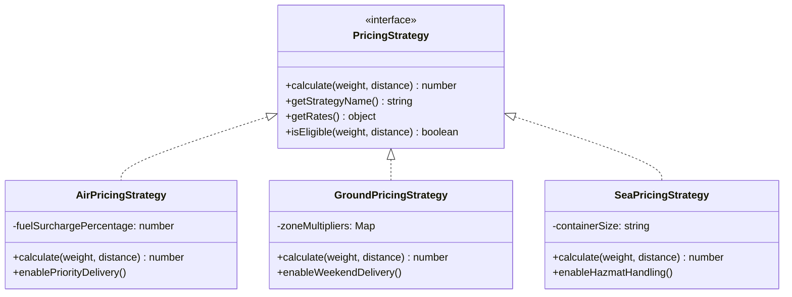
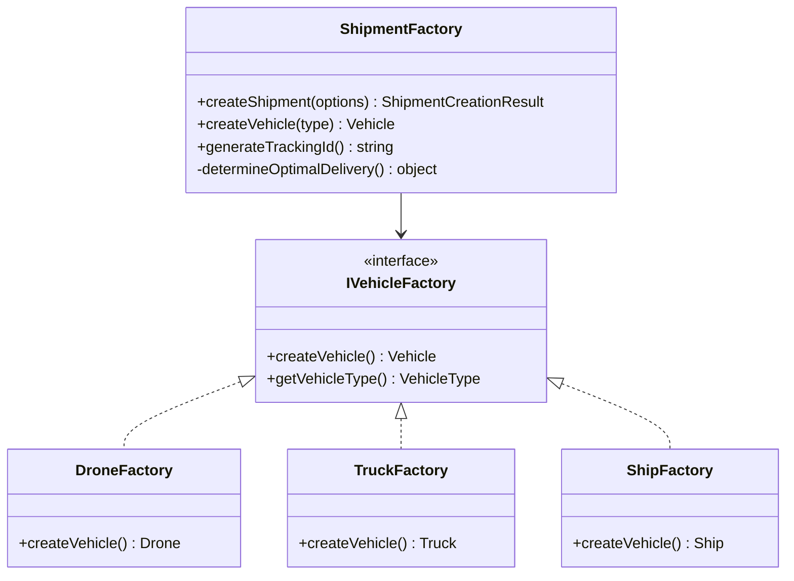

# 🚀 LogIQ - Complete System Architecture & OOP Documentation

## Logistics Management System - Full Stack Implementation

This document provides a comprehensive overview of the entire LogIQ system architecture, including Object-Oriented Programming concepts, design patterns, API layer, real-time features, and deployment infrastructure.

**Last Updated:** December 2025

---

## 📚 Table of Contents

1. [System Overview](#system-overview)
2. [Technology Stack](#technology-stack)
3. [Complete Architecture Diagram](#complete-architecture-diagram)
4. [The Four Pillars of OOP](#the-four-pillars-of-oop)
5. [Design Patterns Used](#design-patterns-used)
6. [Core Domain Layer](#core-domain-layer)
7. [Service Layer](#service-layer)
8. [API Layer](#api-layer)
9. [Real-Time Features](#real-time-features)
10. [Validation Layer](#validation-layer)
11. [Async Processing (Job Queue)](#async-processing-job-queue)
12. [Frontend Components](#frontend-components)
13. [Database Schema](#database-schema)
14. [File Structure](#file-structure)

---

## System Overview

LogIQ is a **full-stack logistics management platform** demonstrating comprehensive OOP principles through a real-world shipping and delivery system. The system features:

- **🚀 Real-time Tracking**: SSE-based live updates for shipments and vehicles
- **🗺️ Interactive Fleet Map**: Leaflet-powered global vehicle tracking
- **📦 Smart Shipment Processing**: Async job queue with Upstash QStash
- **💰 Dynamic Pricing**: Strategy pattern for Air/Ground/Sea pricing
- **👥 Role-based Dashboards**: Customer, Driver, and Admin interfaces
- **🔐 Zod Validation**: Runtime type-safe API validation

---

## Technology Stack

```
┌─────────────────────────────────────────────────────────────────┐
│                        FRONTEND                                  │
├─────────────────────────────────────────────────────────────────┤
│  Next.js 16 (App Router) │ React 19 │ TypeScript │ Tailwind CSS │
│  Framer Motion │ Leaflet.js │ react-hook-form │ Zod            │
└─────────────────────────────────────────────────────────────────┘
                              │
                              ▼
┌─────────────────────────────────────────────────────────────────┐
│                        BACKEND                                   │
├─────────────────────────────────────────────────────────────────┤
│  Next.js API Routes │ Server-Sent Events │ Prisma ORM          │
│  Upstash QStash (Job Queue) │ Upstash Redis (State)            │
└─────────────────────────────────────────────────────────────────┘
                              │
                              ▼
┌─────────────────────────────────────────────────────────────────┐
│                        DATABASE                                  │
├─────────────────────────────────────────────────────────────────┤
│  PostgreSQL (Supabase) │ Prisma Schema │ Connection Pooling    │
└─────────────────────────────────────────────────────────────────┘
```

---

## Complete Architecture Diagram

```
┌──────────────────────────────────────────────────────────────────────────────┐
│                              LogIQ SYSTEM ARCHITECTURE                        │
└──────────────────────────────────────────────────────────────────────────────┘

┌─────────────────────────────────────────────────────────────────────────────┐
│                              PRESENTATION LAYER                              │
│  ┌─────────────────┐  ┌─────────────────┐  ┌─────────────────┐              │
│  │ Customer        │  │ Driver          │  │ Admin           │              │
│  │ Dashboard       │  │ Dashboard       │  │ Dashboard       │              │
│  │ (/dashboard/    │  │ (/dashboard/    │  │ (/dashboard/    │              │
│  │  customer)      │  │  driver)        │  │  admin)         │              │
│  └────────┬────────┘  └────────┬────────┘  └────────┬────────┘              │
│           │                    │                    │                        │
│  ┌────────┴────────────────────┴────────────────────┴────────┐              │
│  │                    REACT COMPONENTS                        │              │
│  │  ┌──────────────────┐ ┌──────────────┐ ┌───────────────┐  │              │
│  │  │CreateShipmentForm│ │ ShipmentCard │ │   FleetMap    │  │              │
│  │  │(react-hook-form) │ │  (display)   │ │  (Leaflet)    │  │              │
│  │  └──────────────────┘ └──────────────┘ └───────────────┘  │              │
│  └───────────────────────────────────────────────────────────┘              │
│           │                                                                  │
│  ┌────────┴─────────────────────────────────────────────────┐               │
│  │                    CUSTOM HOOKS                           │               │
│  │  ┌─────────────────────┐  ┌──────────────────────────┐   │               │
│  │  │ useRealtime()       │  │ useRealtimeRefresh()     │   │               │
│  │  │ (SSE connection)    │  │ (auto-refetch on events) │   │               │
│  │  └─────────────────────┘  └──────────────────────────┘   │               │
│  └──────────────────────────────────────────────────────────┘               │
└─────────────────────────────────────────────────────────────────────────────┘
                                      │
                                      ▼
┌─────────────────────────────────────────────────────────────────────────────┐
│                                API LAYER                                     │
│  ┌────────────────────────────────────────────────────────────────────────┐ │
│  │                         API ROUTES (/api/*)                             │ │
│  ├──────────────┬──────────────┬──────────────┬──────────────────────────┤ │
│  │ /shipments   │ /vehicles    │ /auth/login  │ /admin/stats             │ │
│  │ /shipments/  │ /users/      │ /driver/     │ /simulation              │ │
│  │   [id]       │   first-*    │   assignment │                          │ │
│  ├──────────────┴──────────────┴──────────────┴──────────────────────────┤ │
│  │                         REAL-TIME & JOBS                               │ │
│  │ /api/realtime (SSE)  │  /api/jobs/[id]  │  /api/jobs/process-shipment │ │
│  └────────────────────────────────────────────────────────────────────────┘ │
│                                      │                                       │
│  ┌───────────────────────────────────┴───────────────────────────────────┐  │
│  │                      VALIDATION LAYER (Zod)                            │  │
│  │  ┌─────────────┐ ┌─────────────┐ ┌─────────────┐ ┌─────────────┐      │  │
│  │  │  common.ts  │ │ shipment.ts │ │ vehicle.ts  │ │   user.ts   │      │  │
│  │  │  (UUID,     │ │ (create,    │ │ (create     │ │ (login,     │      │  │
│  │  │   location) │ │  query)     │ │  schema)    │ │  assignment)│      │  │
│  │  └─────────────┘ └─────────────┘ └─────────────┘ └─────────────┘      │  │
│  └───────────────────────────────────────────────────────────────────────┘  │
└─────────────────────────────────────────────────────────────────────────────┘
                                      │
                                      ▼
┌─────────────────────────────────────────────────────────────────────────────┐
│                              SERVICE LAYER                                   │
│  ┌─────────────────────┐ ┌─────────────────────┐ ┌─────────────────────┐    │
│  │   ShipmentService   │ │   VehicleService    │ │    UserService      │    │
│  │ • createShipment()  │ │ • getAvailable()    │ │ • createUser()      │    │
│  │ • getByCustomer()   │ │ • assignToShipment()│ │ • findByEmail()     │    │
│  │ • calculateCost()   │ │ • getByDriver()     │ │                     │    │
│  └──────────┬──────────┘ └──────────┬──────────┘ └──────────┬──────────┘    │
│             │                       │                       │               │
│             └───────────────────────┼───────────────────────┘               │
│                                     ▼                                        │
│  ┌───────────────────────────────────────────────────────────────────────┐  │
│  │                        CORE DOMAIN LAYER                               │  │
│  │                        (OOP Implementation)                            │  │
│  └───────────────────────────────────────────────────────────────────────┘  │
└─────────────────────────────────────────────────────────────────────────────┘
                                      │
                                      ▼
┌─────────────────────────────────────────────────────────────────────────────┐
│                           INFRASTRUCTURE LAYER                               │
│  ┌─────────────────┐ ┌─────────────────┐ ┌─────────────────┐                │
│  │   prisma.ts     │ │   realtime.ts   │ │    queue.ts     │                │
│  │ (DB Client)     │ │ (SSE Emitter)   │ │ (Upstash QStash)│                │
│  └────────┬────────┘ └────────┬────────┘ └────────┬────────┘                │
│           │                   │                   │                          │
│           ▼                   ▼                   ▼                          │
│  ┌─────────────────┐ ┌─────────────────┐ ┌─────────────────┐                │
│  │   PostgreSQL    │ │  In-Memory      │ │  Upstash Redis  │                │
│  │   (Supabase)    │ │  Event Store    │ │  + QStash       │                │
│  └─────────────────┘ └─────────────────┘ └─────────────────┘                │
└─────────────────────────────────────────────────────────────────────────────┘
```

---

## The Four Pillars of OOP

### 1. ENCAPSULATION

**Definition**: Encapsulation is the bundling of data (attributes) and methods that operate on that data within a single unit (class), while restricting direct access to some components.

#### Implementation in this Project:

```
┌─────────────────────────────────────────────────────────────────┐
│                    ENCAPSULATION EXAMPLE                        │
│                         User Class                               │
├─────────────────────────────────────────────────────────────────┤
│  PRIVATE (Hidden)           │  PUBLIC (Exposed)                 │
│  ─────────────────          │  ─────────────────                │
│  - _name: string            │  + get name(): string             │
│  - _email: string           │  + set name(v): void              │
│  - _password: string        │  + get email(): string            │
│  - _notifications: Prefs    │  + verifyPassword(): bool         │
│                             │  + notify(): void                  │
│  ─────────────────          │  ─────────────────                │
│  Password has NO getter     │  Setters include validation       │
│  (write-only for security)  │  touch() updates timestamp        │
└─────────────────────────────────────────────────────────────────┘
```

**Code Example** (See: `User.ts`)

```typescript
export abstract class User extends BaseEntity implements INotifiable {
  // PRIVATE FIELDS - Cannot be accessed directly
  private _name: string;
  private _email: string;
  private _password: string; // Sensitive - protected!

  // CONTROLLED ACCESS via Getters
  public get name(): string {
    return this._name;
  }
  public get email(): string {
    return this._email;
  }

  // VALIDATION in Setters
  public set name(value: string) {
    if (value.trim().length < 2) {
      throw new Error("Name must be at least 2 characters");
    }
    this._name = value.trim();
    this.touch(); // Update timestamp
  }

  // PASSWORD: Write-only (no getter for security)
  public setPassword(newPassword: string): void {
    if (newPassword.length < 8) {
      throw new Error("Password must be at least 8 characters");
    }
    this._password = this.hashPassword(newPassword);
  }
}
```

---

### 2. ABSTRACTION

**Definition**: Abstraction hides complex implementation details and shows only necessary features. It focuses on "what" an object does, not "how" it does it.

#### Interfaces (Contracts)

```
┌─────────────────────────────────────────────────────────────────┐
│                      ABSTRACTION LAYER                          │
├─────────────────────────────────────────────────────────────────┤
│                                                                 │
│  ┌─────────────────┐  ┌─────────────────┐  ┌─────────────────┐ │
│  │   ITrackable    │  │   INotifiable   │  │    IPayable     │ │
│  ├─────────────────┤  ├─────────────────┤  ├─────────────────┤ │
│  │+getTrackingId() │  │+notify()        │  │+processPayment()│ │
│  │+getStatus()     │  │+getPreferences()│  │+refund()        │ │
│  │+getLocation()   │  │+setPreferences()│  │+getHistory()    │ │
│  │+getHistory()    │  │                 │  │                 │ │
│  └────────┬────────┘  └────────┬────────┘  └────────┬────────┘ │
│           │                    │                    │           │
│           ▼                    ▼                    ▼           │
│  ┌─────────────────────────────────────────────────────────────┐│
│  │   Implemented by: Vehicle, Shipment, User                   ││
│  └─────────────────────────────────────────────────────────────┘│
└─────────────────────────────────────────────────────────────────┘
```

**Code Example:**

```typescript
// Interface defines WHAT, not HOW
export interface ITrackable {
  getTrackingId(): string;
  getStatus(): string;
  getCurrentLocation(): Location;
  getTrackingHistory(): TrackingEvent[];
}

// Abstract class provides partial implementation
export abstract class BaseEntity {
  abstract validate(): boolean; // Subclasses MUST implement
  abstract toJSON(): object; // Subclasses MUST implement

  protected touch(): void {
    // Shared implementation
    this._updatedAt = new Date();
  }
}
```

---

### 3. INHERITANCE

**Definition**: Inheritance allows a class to inherit properties and methods from another class, promoting code reuse and establishing "is-a" relationships.

#### Complete Class Hierarchy

```
┌─────────────────────────────────────────────────────────────────────────────┐
│                         INHERITANCE HIERARCHY                                │
├─────────────────────────────────────────────────────────────────────────────┤
│                                                                              │
│                            ┌──────────────┐                                  │
│                            │  BaseEntity  │ (Abstract)                       │
│                            │──────────────│                                  │
│                            │ - _id        │                                  │
│                            │ - _createdAt │                                  │
│                            │ - _updatedAt │                                  │
│                            │ + touch()    │                                  │
│                            └──────┬───────┘                                  │
│                    ┌──────────────┼──────────────┐                           │
│                    ▼              ▼              ▼                           │
│            ┌────────────┐  ┌────────────┐  ┌────────────┐                   │
│            │    User    │  │  Vehicle   │  │  Shipment  │                   │
│            │ (Abstract) │  │ (Abstract) │  │            │                   │
│            └──────┬─────┘  └──────┬─────┘  └────────────┘                   │
│         ┌─────────┼─────────┐     │                                          │
│         ▼         ▼         ▼     │                                          │
│   ┌──────────┐┌───────┐┌───────┐  │                                          │
│   │ Customer ││ Driver││ Admin │  │                                          │
│   └──────────┘└───────┘└───────┘  │                                          │
│                            ┌──────┴──────┬──────────┐                        │
│                            ▼             ▼          ▼                        │
│                       ┌────────┐    ┌────────┐  ┌────────┐                   │
│                       │  Drone │    │  Truck │  │  Ship  │                   │
│                       └────────┘    └────────┘  └────────┘                   │
│                                                                              │
├─────────────────────────────────────────────────────────────────────────────┤
│                        PRICING STRATEGY HIERARCHY                            │
├─────────────────────────────────────────────────────────────────────────────┤
│                                                                              │
│                      ┌─────────────────────────┐                            │
│                      │  BasePricingStrategy    │ (Abstract)                  │
│                      │─────────────────────────│                            │
│                      │ + calculate() [template]│                            │
│                      │ # applyDiscount() [hook]│                            │
│                      └───────────┬─────────────┘                            │
│               ┌──────────────────┼──────────────────┐                       │
│               ▼                  ▼                  ▼                       │
│      ┌─────────────────┐ ┌─────────────────┐ ┌─────────────────┐           │
│      │ AirPricing      │ │ GroundPricing   │ │  SeaPricing     │           │
│      │ Strategy        │ │ Strategy        │ │  Strategy       │           │
│      │─────────────────│ │─────────────────│ │─────────────────│           │
│      │ $2.5/kg         │ │ $0.5/kg         │ │ $0.1/kg         │           │
│      │ $1.5/km         │ │ $0.8/km         │ │ $0.2/km         │           │
│      │ 15% fuel charge │ │ zone multipliers│ │ port fees       │           │
│      └─────────────────┘ └─────────────────┘ └─────────────────┘           │
└─────────────────────────────────────────────────────────────────────────────┘
```

---

### 4. POLYMORPHISM

**Definition**: Polymorphism allows objects of different classes to be treated as objects of a common parent class. Same method name, different implementations.

#### Polymorphism in Action

```
┌─────────────────────────────────────────────────────────────────────────────┐
│                         POLYMORPHISM EXAMPLE                                 │
│                         Vehicle.move() Method                                │
├─────────────────────────────────────────────────────────────────────────────┤
│                                                                              │
│  function calculateRoute(vehicle: Vehicle, from: Location, to: Location) {  │
│      return vehicle.move(from, to);  // Polymorphic call                    │
│  }                                                                           │
│                                                                              │
│  ┌───────────────────────────────────────────────────────────────────────┐  │
│  │  Same method call → Different implementations based on actual type    │  │
│  └───────────────────────────────────────────────────────────────────────┘  │
│                                                                              │
│  ┌─────────────────┐  ┌─────────────────┐  ┌─────────────────┐              │
│  │     DRONE       │  │     TRUCK       │  │      SHIP       │              │
│  │    move()       │  │    move()       │  │    move()       │              │
│  ├─────────────────┤  ├─────────────────┤  ├─────────────────┤              │
│  │ • Geodesic path │  │ • Road network  │  │ • Maritime route│              │
│  │ • Straight line │  │ • Manhattan dist│  │ • 1.3x longer   │              │
│  │ • 60 km/h       │  │ • 90 km/h       │  │ • 35 km/h       │              │
│  │ • Max 50kg      │  │ • Max 5000kg    │  │ • Max 50000kg   │              │
│  └─────────────────┘  └─────────────────┘  └─────────────────┘              │
│         │                    │                    │                          │
│         ▼                    ▼                    ▼                          │
│   NYC → LA: 3940km     NYC → LA: 4500km    NYC → LA: 5122km                 │
│   65.7 hours           50.0 hours          146.3 hours                       │
└─────────────────────────────────────────────────────────────────────────────┘
```

**Code Example:**

```typescript
// Abstract method in parent
abstract class Vehicle {
  abstract move(from: Location, to: Location): Route;
  abstract getMaxSpeed(): number;
}

// Different implementations in each subclass
class Drone extends Vehicle {
  move(from: Location, to: Location): Route {
    // Geodesic (straight line) calculation
    const distance = haversine(from, to);
    return { path: [from, to], distance, estimatedTime: distance / 60 };
  }
  getMaxSpeed(): number {
    return 60;
  }
}

class Truck extends Vehicle {
  move(from: Location, to: Location): Route {
    // Manhattan distance (roads)
    const distance = Math.abs(to.lat - from.lat) + Math.abs(to.lng - from.lng);
    return {
      path: [from, midpoint, to],
      distance: distance * 111,
      estimatedTime: distance / 90,
    };
  }
  getMaxSpeed(): number {
    return 90;
  }
}
```

---

## Design Patterns Used

### 1. Strategy Pattern (Pricing)

The Strategy pattern allows the pricing algorithm to be selected at runtime. Each shipping type (Air, Ground, Sea) has its own pricing strategy.

```
┌─────────────────────────────────────────────────────────────────────────────┐
│                         STRATEGY PATTERN                                     │
│                         Pricing Strategies                                   │
├─────────────────────────────────────────────────────────────────────────────┤
│                                                                              │
│                    ┌───────────────────────────┐                            │
│                    │   <<interface>>           │                            │
│                    │   PricingStrategy         │                            │
│                    │───────────────────────────│                            │
│                    │ + calculate(w, d): number │                            │
│                    │ + getStrategyName(): str  │                            │
│                    │ + getRates(): RateInfo    │                            │
│                    │ + isEligible(w, d): bool  │                            │
│                    └─────────────┬─────────────┘                            │
│                                  │                                          │
│            ┌─────────────────────┼─────────────────────┐                    │
│            │                     │                     │                    │
│            ▼                     ▼                     ▼                    │
│  ┌──────────────────┐  ┌──────────────────┐  ┌──────────────────┐          │
│  │ AirPricing       │  │ GroundPricing    │  │ SeaPricing       │          │
│  │ Strategy         │  │ Strategy         │  │ Strategy         │          │
│  │──────────────────│  │──────────────────│  │──────────────────│          │
│  │ weightRate: 2.5  │  │ weightRate: 0.5  │  │ weightRate: 0.1  │          │
│  │ distRate: 1.5    │  │ distRate: 0.8    │  │ distRate: 0.2    │          │
│  │ fuelSurcharge:15%│  │ zoneMultipliers  │  │ containerFees    │          │
│  │ urgencyRate: 50% │  │ tollFees         │  │ portFees         │          │
│  └──────────────────┘  └──────────────────┘  └──────────────────┘          │
│                                                                              │
│  ┌───────────────────────────────────────────────────────────────────────┐  │
│  │  Usage: shipment.calculateCost(new AirPricingStrategy())              │  │
│  │         shipment.calculateCost(new GroundPricingStrategy())           │  │
│  │         shipment.calculateCost(new SeaPricingStrategy())              │  │
│  └───────────────────────────────────────────────────────────────────────┘  │
└─────────────────────────────────────────────────────────────────────────────┘
```



---

### 2. Factory Pattern (Shipment & Vehicle Creation)

The Factory pattern encapsulates object creation logic, allowing complex objects to be created without exposing the creation logic.

```
┌─────────────────────────────────────────────────────────────────────────────┐
│                          FACTORY PATTERN                                     │
│                     Shipment & Vehicle Factories                             │
├─────────────────────────────────────────────────────────────────────────────┤
│                                                                              │
│  ┌────────────────────────────────────────────────────────────────────────┐ │
│  │                        ShipmentFactory                                  │ │
│  │────────────────────────────────────────────────────────────────────────│ │
│  │  STATIC METHODS:                                                        │ │
│  │  + createShipment(options): ShipmentResult                             │ │
│  │  + generateTrackingId(): string                                         │ │
│  │  + recommendVehicle(weight, type, urgency): VehicleType                │ │
│  │  + estimateDelivery(type, distance): number                            │ │
│  │  + validateShipmentOptions(options): boolean                           │ │
│  │                                                                         │ │
│  │  RETURNS: { shipment, estimatedCost, recommendedVehicle, deliveryDays }│ │
│  └────────────────────────────────────────────────────────────────────────┘ │
│                                                                              │
│  ┌────────────────────────────────────────────────────────────────────────┐ │
│  │                    Abstract Vehicle Factory                             │ │
│  │────────────────────────────────────────────────────────────────────────│ │
│  │                                                                         │ │
│  │              ┌────────────────────────┐                                │ │
│  │              │ <<interface>>          │                                │ │
│  │              │ IVehicleFactory        │                                │ │
│  │              │────────────────────────│                                │ │
│  │              │ + create(opts): Vehicle│                                │ │
│  │              │ + getType(): VehicleType│                               │ │
│  │              └───────────┬────────────┘                                │ │
│  │                          │                                              │ │
│  │        ┌─────────────────┼─────────────────┐                           │ │
│  │        ▼                 ▼                 ▼                           │ │
│  │  ┌───────────┐    ┌───────────┐    ┌───────────┐                      │ │
│  │  │  Drone    │    │  Truck    │    │  Ship     │                      │ │
│  │  │  Factory  │    │  Factory  │    │  Factory  │                      │ │
│  │  └───────────┘    └───────────┘    └───────────┘                      │ │
│  └────────────────────────────────────────────────────────────────────────┘ │
└─────────────────────────────────────────────────────────────────────────────┘
```



---

### 3. Builder Pattern (Shipment Builder)

The Builder pattern constructs complex objects step by step with a fluent interface.

```
┌─────────────────────────────────────────────────────────────────────────────┐
│                          BUILDER PATTERN                                     │
│                        ShipmentBuilder                                       │
├─────────────────────────────────────────────────────────────────────────────┤
│                                                                              │
│  ┌────────────────────────────────────────────────────────────────────────┐ │
│  │                        ShipmentBuilder                                  │ │
│  │────────────────────────────────────────────────────────────────────────│ │
│  │  - trackingId: string                                                   │ │
│  │  - weight: number                                                       │ │
│  │  - origin: Location                                                     │ │
│  │  - destination: Location                                                │ │
│  │  - type: ShipmentType                                                   │ │
│  │  - customerId: string                                                   │ │
│  │────────────────────────────────────────────────────────────────────────│ │
│  │  + static create(): ShipmentBuilder                                     │ │
│  │  + setTrackingId(id): this                                             │ │
│  │  + setWeight(weight): this                                             │ │
│  │  + setOrigin(location): this                                           │ │
│  │  + setDestination(location): this                                      │ │
│  │  + setType(type): this                                                 │ │
│  │  + setCustomerId(id): this                                             │ │
│  │  + addInsurance(value): this                                           │ │
│  │  + build(): ShipmentResult                                             │ │
│  └────────────────────────────────────────────────────────────────────────┘ │
│                                                                              │
│  USAGE (Fluent Interface):                                                   │
│  ┌────────────────────────────────────────────────────────────────────────┐ │
│  │  const result = ShipmentBuilder.create()                                │ │
│  │    .setTrackingId("TRK-001")                                           │ │
│  │    .setWeight(25)                                                       │ │
│  │    .setOrigin({ lat: 40.71, lng: -74.01 })                             │ │
│  │    .setDestination({ lat: 34.05, lng: -118.24 })                       │ │
│  │    .setType(ShipmentType.AIR)                                          │ │
│  │    .setCustomerId("customer-123")                                       │ │
│  │    .addInsurance(5000)                                                  │ │
│  │    .build();                                                            │ │
│  └────────────────────────────────────────────────────────────────────────┘ │
└─────────────────────────────────────────────────────────────────────────────┘
```

```typescript
// Fluent interface for complex object construction
const result = ShipmentBuilder.create()
  .setTrackingId("TRK-001")
  .setWeight(25)
  .setOrigin({ lat: 40.7128, lng: -74.006 })
  .setDestination({ lat: 34.0522, lng: -118.2437 })
  .setCustomer(customer)
  .setUrgency("high")
  .setInsurance(5000)
  .build();
```

---

### 4. Observer Pattern (Real-Time Events)

The Observer pattern is implemented via Server-Sent Events for real-time updates.

```
┌─────────────────────────────────────────────────────────────────────────────┐
│                         OBSERVER PATTERN                                     │
│                     Real-Time Event System                                   │
├─────────────────────────────────────────────────────────────────────────────┤
│                                                                              │
│                    ┌────────────────────────┐                               │
│                    │   RealtimeEmitter      │ (Subject/Observable)          │
│                    │   (Singleton)          │                               │
│                    │────────────────────────│                               │
│                    │ - clients: Set<Client> │                               │
│                    │ + subscribe(client)    │                               │
│                    │ + unsubscribe(client)  │                               │
│                    │ + emit(event)          │                               │
│                    └───────────┬────────────┘                               │
│                                │                                             │
│                    ┌───────────┴───────────┐                                │
│                    │     BROADCASTS TO     │                                │
│                    └───────────┬───────────┘                                │
│                                │                                             │
│          ┌─────────────────────┼─────────────────────┐                      │
│          ▼                     ▼                     ▼                      │
│  ┌──────────────┐     ┌──────────────┐     ┌──────────────┐                │
│  │  Customer    │     │   Driver     │     │   Admin      │                │
│  │  Dashboard   │     │  Dashboard   │     │  Dashboard   │                │
│  │──────────────│     │──────────────│     │──────────────│                │
│  │ useRealtime()│     │ useRealtime()│     │ useRealtime()│                │
│  │ onShipment   │     │ onAssignment │     │ onVehicle    │                │
│  │ onStatus     │     │ onVehicle    │     │ onShipment   │                │
│  └──────────────┘     └──────────────┘     └──────────────┘                │
│                                                                              │
│  EVENT TYPES:                                                               │
│  • shipment_update  • vehicle_update   • new_shipment                       │
│  • assignment_update • stats_update    • simulation_step                    │
│                                                                              │
└─────────────────────────────────────────────────────────────────────────────┘
```

---

### 5. Singleton Pattern (Database & Event Emitter)

```
┌─────────────────────────────────────────────────────────────────────────────┐
│                         SINGLETON PATTERN                                    │
├─────────────────────────────────────────────────────────────────────────────┤
│                                                                              │
│  ┌─────────────────────────┐        ┌─────────────────────────┐            │
│  │   Prisma Client         │        │   RealtimeEmitter       │            │
│  │   (prisma.ts)           │        │   (realtime.ts)         │            │
│  │─────────────────────────│        │─────────────────────────│            │
│  │ globalForPrisma.prisma  │        │ realtimeEmitter         │            │
│  │ (single instance)       │        │ (single instance)       │            │
│  └─────────────────────────┘        └─────────────────────────┘            │
│                                                                              │
│  Ensures only ONE database connection and ONE event emitter exist           │
│                                                                              │
└─────────────────────────────────────────────────────────────────────────────┘
```

---

### 6. Template Method Pattern (Pricing)

```
┌─────────────────────────────────────────────────────────────────────────────┐
│                      TEMPLATE METHOD PATTERN                                 │
├─────────────────────────────────────────────────────────────────────────────┤
│                                                                              │
│  ┌────────────────────────────────────────────────────────────────────────┐ │
│  │  BasePricingStrategy (Abstract)                                         │ │
│  │────────────────────────────────────────────────────────────────────────│ │
│  │  TEMPLATE METHOD (defines algorithm structure):                         │ │
│  │                                                                         │ │
│  │  calculate(weight, distance) {                                          │ │
│  │    const base = this.calculateBaseCost(weight, distance);  // Step 1   │ │
│  │    const withSurcharges = this.applySurcharges(base);      // Step 2   │ │
│  │    return this.applyDiscount(withSurcharges);              // Hook     │ │
│  │  }                                                                      │ │
│  │                                                                         │ │
│  │  # calculateBaseCost()  → ABSTRACT (subclasses must implement)         │ │
│  │  # applySurcharges()    → ABSTRACT (subclasses must implement)         │ │
│  │  # applyDiscount()      → HOOK (optional override, default: no change) │ │
│  └────────────────────────────────────────────────────────────────────────┘ │
│                                                                              │
└─────────────────────────────────────────────────────────────────────────────┘
```

---

## UML Class Diagrams

### Complete System Architecture


---

## Code Examples

### Creating a Customer and Shipment

```typescript
import { Customer } from "./core/User";
import { ShipmentFactory, ShipmentBuilder } from "./core/ShipmentFactory";
import { ShipmentType } from "./core/Shipment";

// Create a customer
const customer = new Customer(
  "cust-001",
  "John Doe",
  "john@email.com",
  "password123"
);
customer.addShippingAddress({
  street: "123 Main St",
  city: "New York",
  state: "NY",
  zip: "10001",
  isDefault: true,
});

// Method 1: Using Factory
const result1 = ShipmentFactory.createShipment({
  trackingId: ShipmentFactory.generateTrackingId(),
  weight: 25,
  origin: { lat: 40.7128, lng: -74.006 },
  destination: { lat: 34.0522, lng: -118.2437 },
  customer: customer,
  urgency: "high",
  shipmentType: ShipmentType.EXPRESS,
  insuranceValue: 5000,
});

console.log(`Cost: $${result1.estimatedCost}`);
console.log(`Vehicle: ${result1.recommendedVehicle.type}`);
console.log(`Delivery in: ${result1.estimatedDeliveryDays} days`);

// Method 2: Using Builder Pattern
const result2 = ShipmentBuilder.create()
  .setTrackingId("TRK-CUSTOM-001")
  .setWeight(100)
  .setOrigin({ lat: 51.5074, lng: -0.1278 })
  .setDestination({ lat: 48.8566, lng: 2.3522 })
  .setCustomer(customer)
  .setUrgency("standard")
  .setInsurance(2000)
  .build();
```

### Polymorphism in Route Calculation

```typescript
import { Drone, Truck, Ship, Vehicle } from "./core/Vehicle";
import { Location, Route } from "./core/types";

// Create different vehicle types
const vehicles: Vehicle[] = [
  new Drone("d1", "DRN-001", 120),
  new Truck("t1", "TRK-001", 4),
  new Ship("s1", "SHP-001", 1000),
];

const origin: Location = { lat: 40.7128, lng: -74.006 }; // NYC
const destination: Location = { lat: 51.5074, lng: -0.1278 }; // London

// Polymorphism: Same code, different behaviors
vehicles.forEach((vehicle) => {
  const route: Route = vehicle.move(origin, destination);
  console.log(
    `${vehicle.type}: ${route.distance.toFixed(
      2
    )}km in ${route.estimatedTime.toFixed(0)} minutes`
  );
  // Output:
  // DRONE: 5571.23km in 5571 minutes (direct path)
  // TRUCK: 6183.67km in 4122 minutes (road path)
  // SHIP: 7242.60km in 12412 minutes (sea route)
});
```

### Using Strategy Pattern for Pricing

```typescript
import { Shipment, ShipmentType } from "./core/Shipment";
import {
  AirPricingStrategy,
  GroundPricingStrategy,
  SeaPricingStrategy,
  PricingStrategyFactory,
} from "./core/PricingStrategy";

// Same shipment, different strategies
const shipment = new Shipment(/*...*/);

// Compare prices using different strategies
const strategies = [
  new AirPricingStrategy(),
  new GroundPricingStrategy(),
  new SeaPricingStrategy(),
];

strategies.forEach((strategy) => {
  shipment.calculateCost(strategy);
  console.log(`${strategy.getStrategyName()}: $${shipment.cost.toFixed(2)}`);
});

// Or use the factory to get the cheapest option
const bestStrategy = PricingStrategyFactory.recommend(25, 1000);
console.log(`Recommended: ${bestStrategy.getStrategyName()}`);
```

---

## File Structure

```
src/core/
├── base/
│   ├── BaseEntity.ts      # Abstract base class for all entities
│   └── BaseService.ts     # Abstract base class for services
├── interfaces/
│   ├── ITrackable.ts      # Tracking interface (abstraction)
│   ├── INotifiable.ts     # Notification interface (abstraction)
│   └── IPayable.ts        # Payment interface (abstraction)
├── User.ts                # User hierarchy (Customer, Driver, Admin)
├── Vehicle.ts             # Vehicle hierarchy (Drone, Truck, Ship)
├── Shipment.ts            # Shipment class with tracking & payments
├── ShipmentFactory.ts     # Factory & Builder patterns
├── PricingStrategy.ts     # Strategy pattern for pricing
└── types.ts               # TypeScript enums and type definitions
```

---

## Summary Table

| OOP Pillar        | Where Demonstrated                                 | Example                                                             |
| ----------------- | -------------------------------------------------- | ------------------------------------------------------------------- |
| **Encapsulation** | `User.ts`, `Vehicle.ts`, `Shipment.ts`             | Private fields (`_name`, `_email`), getters/setters with validation |
| **Abstraction**   | `ITrackable.ts`, `INotifiable.ts`, `BaseEntity.ts` | Interfaces define contracts, abstract classes hide implementation   |
| **Inheritance**   | `Customer extends User`, `Drone extends Vehicle`   | Code reuse, shared functionality in parent classes                  |
| **Polymorphism**  | `Vehicle.move()`, `PricingStrategy.calculate()`    | Same method, different implementations per subclass                 |

---

## Design Patterns Summary

| Pattern             | Implementation                               | Purpose                                              |
| ------------------- | -------------------------------------------- | ---------------------------------------------------- |
| **Strategy**        | `PricingStrategy` + concrete implementations | Interchangeable algorithms at runtime                |
| **Factory**         | `ShipmentFactory`, `VehicleFactory`          | Object creation without exposing logic               |
| **Builder**         | `ShipmentBuilder`                            | Complex object construction with fluent interface    |
| **Template Method** | `BasePricingStrategy.calculate()`            | Define algorithm skeleton, defer steps to subclasses |

---

## Conclusion

This project demonstrates a comprehensive implementation of all four OOP pillars:

1. **Encapsulation**: Protected internal state with controlled access
2. **Abstraction**: Clear interfaces and abstract classes hiding complexity
3. **Inheritance**: Hierarchical class structure for code reuse
4. **Polymorphism**: Same interfaces, different behaviors

Combined with classic design patterns (Strategy, Factory, Builder), this architecture provides:

- ✅ Maintainable and extensible code
- ✅ Clear separation of concerns
- ✅ Type-safe implementation with TypeScript
- ✅ Easy testing through dependency injection
- ✅ Real-world applicability

---

_Generated for the Logistics Management System - A demonstration of Object-Oriented Programming principles_
